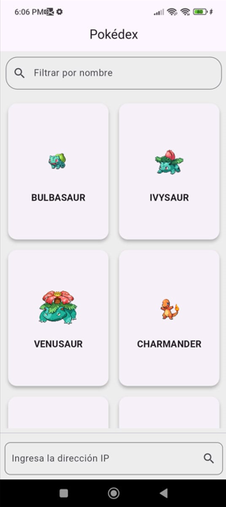
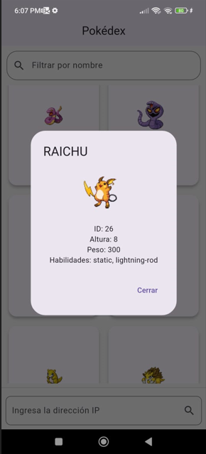
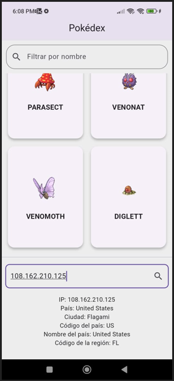
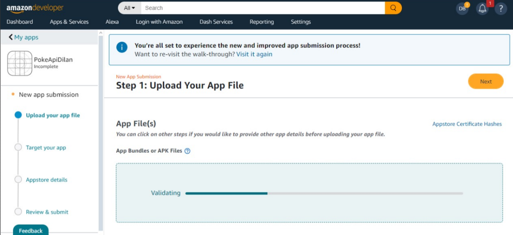

# Pokemon API Flutter App - Mejorado

Este repositorio contiene una aplicación Flutter desarrollada como parte de una actividad académica. La aplicación permite buscar y mostrar información sobre Pokémons y utiliza APIs adicionales para enriquecer las funcionalidades.

---

## Actividades Realizadas

### Actividad 1: Mostrar Pokémons

Se desarrolló una aplicación que consume la API de Pokémon [PokeAPI](https://pokeapi.co/). La aplicación permite buscar un Pokémon por su nombre y mostrar su imagen junto con información básica sobre sus características.

### Actividad 2: Integración de otra API

Se utilizó la API [IP Info](https://ipinfo.io/) para obtener y mostrar información adicional como la ubicación basada en direcciones IP. Esta funcionalidad complementa la aplicación y ofrece datos interesantes al usuario.

---

## Características de la Aplicación

1. **Búsqueda de Pokémons:** Permite ingresar el nombre de un Pokémon para obtener información detallada.
2. **Integración de APIs Adicionales:** Muestra información basada en la dirección IP del usuario.
---

## Requisitos

- Flutter SDK 3.0 o superior.
- Android Studio o Visual Studio Code con extensión de Flutter.
- Conexión a Internet para consumir las APIs.

---

## Instalación

1. Clonar este repositorio:

   ```bash
   git clone https://github.com/jzaldumbide/pokemonapi_flutter.git
   ```

2. Navegar al directorio del proyecto:

   ```bash
   cd pokemonapi_flutter
   ```

3. Instalar las dependencias:

   ```bash
   flutter pub get
   ```

4. Ejecutar la aplicación:

   ```bash
   flutter run
   ```

---

## Capturas de Pantalla

### Actividad 1: Búsqueda de Pokémons




### Actividad 2: Integración de IP Info 




---
## Publicación en Amazon Developer

La aplicación ha sido publicada exitosamente en la plataforma Amazon Developer. A continuación, se incluyen capturas de pantalla del proceso de subida y configuración en Amazon Developer:

Captura 1: Configuración de la Publicación



Captura 2: Subida de la Aplicación


## Enlace de la aplicación
[Click Aquí](https://www.amazon.com/gp/product/B0DS94RJNB)

## Desarrollador

- **Dilan Bedoya Augusto León**


---


---


